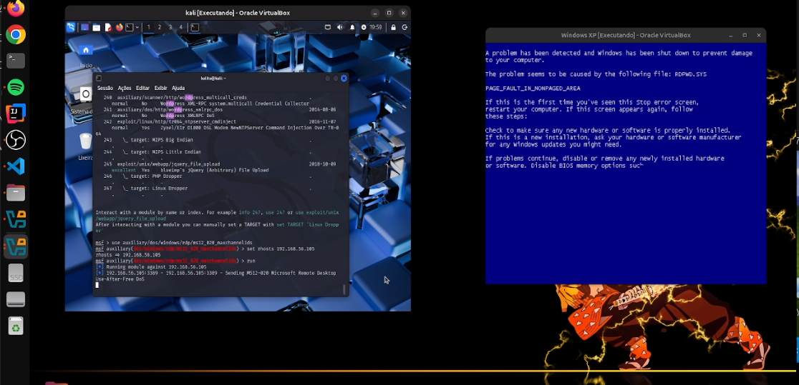
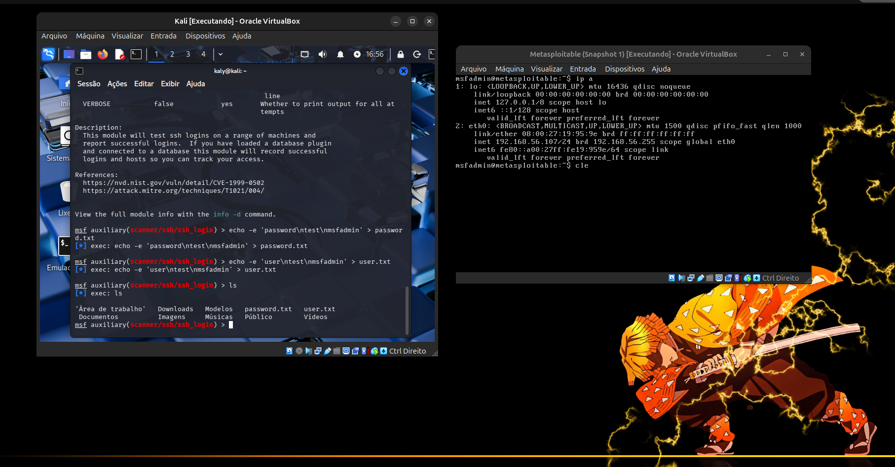
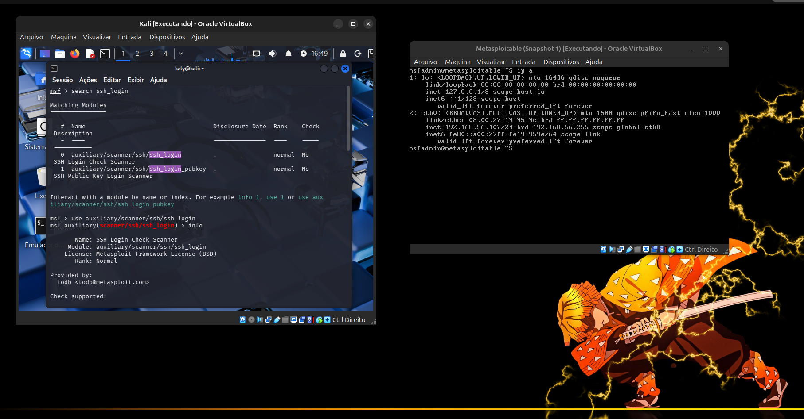
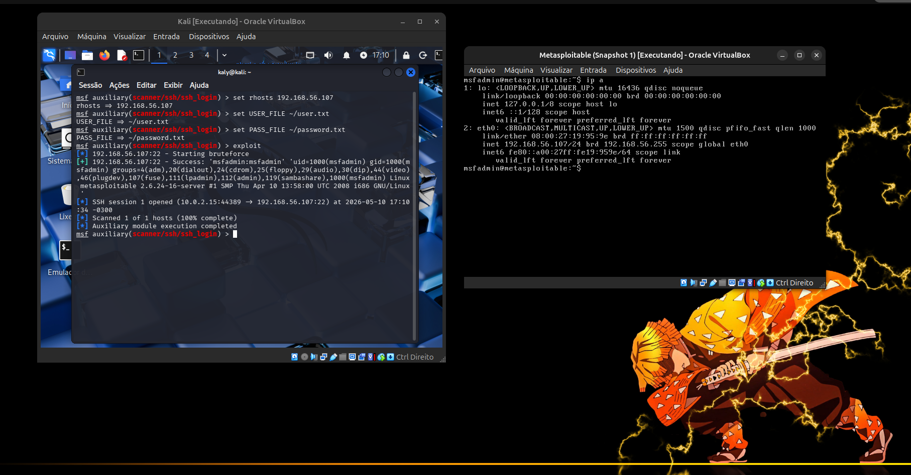
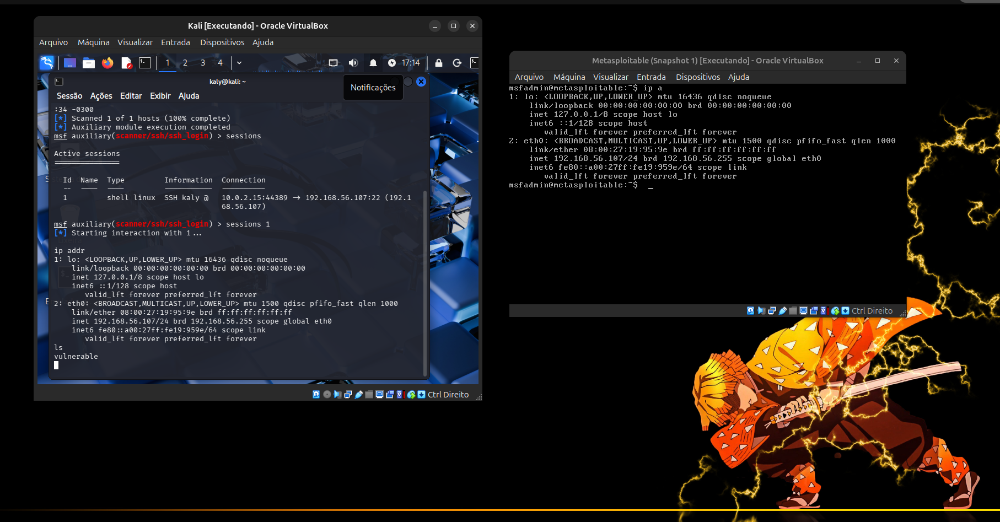

<a name="topo"></a>

# 🛡️ Técnicas de Exploração de Vulnerabilidades

Este repositório reúne uma série de laboratórios práticos focados em Segurança Ofensiva e Pentest. O objetivo é documentar o ciclo completo de exploração: do reconhecimento à pós-exploração, analisando falhas críticas em diferentes protocolos e sistemas.


## 📑 Sumário de Explorações
1. [Exploração de Backdoor (VSFTPD v2.3.4)](#1-exploração-de-backdoor-vsftpd-v234)
2. [Negação de Serviço DoS](#2-negação-de-serviço-dos)
3. [Exploração de Falha em SSH (Brute Force Attack)](#3-exploração-de-falha-em-ssh-brute-force-attack)
4. [Adicionando Backdoor em um Executável](#4-adicionando-backdoor-em-um-executável)

---

### 1. Exploração de Backdoor (VSFTPD v2.3.4)

Aqui explorei uma vulnerabilidade histórica no serviço de FTP de um servidor Linux (Metasploitable 2), utilizando o **Metasploit** Framework no *Kali Linux*.

📝 **Descrição Técnica:**

A versão 2.3.4 do vsftpd continha uma vulnerabilidade de *backdoor* (porta dos fundos) que permitia a execução remota de comandos com privilégios de root. O ataque consiste em disparar uma sequência específica de caracteres que abre uma porta de escuta para acesso direto à *shell* do sistema.


🛠️ Tecnologias e Ferramentas

    Atacante: Kali Linux.

    Alvo: Metasploitable 2.

    Framework: Metasploit (msfconsole).

    Módulo: exploit/unix/ftp/vsftpd_234_backdoor.

    Carga Útil (Payload): payload/cmd/unix/interact.
    

# 🚀 Passo a Passo da Execução:

### 1.1- Reconhecimento e Pesquisa:

Iniciei o Metasploit e pesquisei pelo módulo específico para a versão do serviço FTP identificada na fase de enumeração.   
```Bash
msfconsole
search vsftpd


```

 Etapa 1: msfconsole | Etapa 2: search vsftpd |
|:---:|:---:|
| <br><sup>Terminal com comando *msfconsole*.</sup> | <br><sup>Terminal com comando *search vsftpd*.</sup> |

### 1.2- Configuração do Módulo:

Selecionei o exploit e configurei o alvo (RHOSTS) com o endereço IP da máquina vulnerável.
```Bash
use exploit/unix/ftp/vsftpd_234_backdoor
set rhosts [ip_maquina_alvo]
set payload payload/cmd/unix/interact
```
Etapa 3: Exploit | Etapa 4: payload |
|:---:|:---:|
| <br><sup>Terminal com comando *exploit*.</sup> | <br><sup>Terminal com comando *payload*.</sup> |

### 1.3- Exploração e Ganho de Acesso

Ao executar o comando **exploit**, o *framework* identificou o banner vulnerável, disparou o gatilho do backdoor e estabeleceu uma conexão reversa estável.
```Bash
exploit
```

Etapa 5: Exploit | 
|:---:|
| <br><sup>Terminal com comando *exploit*.</sup> |

**Resultado:** Uma sessão de comando foi aberta com privilégios de UID: 0 (root).

### 1.4- Pós-Exploração e Prova de Conceito (PoC)

Para demonstrar o controle total sobre o sistema, naveguei pelos diretórios e modifiquei um arquivo *.txt* no servidor alvo.
```Bash
ls (visualizei os arquivos e selecionei o alvo)
echo "Seu pc foi hackeado!!!!!" > flag.txt 
cat flag.txt
```
Etapa 5: Prova | 
|:---:|
| <br><sup>Terminal com mensagem final.</sup> |

🔒 **Medidas de Mitigação:**

    Atualização de Software: A principal defesa contra este ataque é a atualização para uma versão 
    estável e segura do vsftpd (superior à 2.3.4).

    Hardening de Serviços: Desativar banners de versão para dificultar o reconhecimento por parte 
    de atacantes.

    Firewall: Bloquear portas não essenciais.

[↑ Voltar ao topo](#topo)

---

### 2- Negação de Serviço DoS 
## (Blue Screen of Death - BSOD)

Neste laboratório, explorei a vulnerabilidade crítica *MS12-020* no protocolo *RDP* (Remote Desktop Protocol). O objetivo foi demonstrar como pacotes malformados podem causar o colapso total do Kernel de um sistema operacional.

📝 **Descrição Técnica:**

A falha reside na forma como o driver de terminal do Windows (termdd.sys) manipula sequências específicas de pacotes RDP. Ao enviar requisições com IDs de canais inválidos, ocorre uma corrupção de memória que resulta em uma interrupção crítica, forçando o sistema a exibir a "Tela Azul da Morte" (BSOD) para evitar danos ao hardware.

🛠️ Tecnologias e Ferramentas:

    Atacante: Kali Linux.

    Alvo: Windows XP Professional (Ambiente de Teste).

    Framework: Metasploit (msfconsole).

    Módulo: auxiliary/dos/windows/rdp/ms12_020_maxchannelids.


# 🚀 Jornada de Execução e Adaptação:

### 2.1- O Desafio do Windows 7 Starter:

Inicialmente, os testes foram realizados em um Windows 7 Starter. No entanto, identifiquei que a versão específica não possui o servidor de RDP nativo, o que impediu a exploração direta da porta 3389. Em vez de desistir, a estratégia foi adaptada para um ambiente Windows XP, onde o protocolo pôde ser habilitado para a demonstração da falha.

### 2.2- Preparação do Alvo (Windows XP):

Para que o ataque fosse bem-sucedido, foram necessárias as seguintes configurações na máquina alvo:

    1- Habilitação de Conexões Remotas (RDP).
    
    2- Desativação completa de Firewall do Windows.
    
    3- Verificação da porta ativa via CMD:
```Bash
netstat -an | findstr :3389.
```
### 2.3- Configuração e Disparo no Metasploit:
```Bash
use auxiliary/dos/windows/rdp/ms12_020_maxchannelids
set RHOSTS [ip_maquina_alvo]
run
```
| Evidência da Exploração: Configuração e Tela Azul |
|:---:|
| <br><sup>À esquerda: Execução do exploit no Metasploit. À direita: Tela Azul (BSOD) no Windows XP.</sup> |

**Resultado:** O sistema alvo interrompeu suas atividades instantaneamente, exibindo o erro no arquivo RDPWD.SYS, confirmando a eficácia do DoS.

🔒 Medidas de Mitigação:

    Atualização (Patching): Instalação da atualização de segurança KB2671387.

    NLA: Habilitar a Autenticação no Nível da Rede (Network Level 
    Authentication), que exige login antes do processamento dos pacotes RDP.

    Desativação: Desabilitar o serviço RDP caso não seja estritamente 
    necessário.


# ⚠️ Nenhum Windows XP foi ferido permanentemente (foi só um reboot) durante este experimento.

[↑ Voltar ao topo](#topo)

---

### 3. Exploração de Falha em SSH (Brute Force Attack)

Neste laboratório, realizei um ataque de força bruta *(Brute Force)* contra o serviço de **SSH** do servidor Metasploitable 2. O objetivo foi demonstrar como credenciais fracas podem comprometer o acesso remoto de um servidor em segundos.

📝 **Descrição Técnica**:

O ataque utiliza o protocolo SSH (porta 22) para tentar descobrir combinações válidas de *usuários e senhas*. Através de listas de palavras (**wordlists**) e **automatização** via Metasploit, o módulo testa múltiplas entradas até encontrar uma credencial que permita a abertura de uma sessão de comando (*shell*).

🛠️ Tecnologias e Ferramentas:

    Atacante: Kali Linux.

    Alvo: Metasploitable 2.

    Framework: Metasploit (msfconsole).

    Módulo: auxiliary/scanner/ssh/ssh_login.

    Técnica: Brute Force com Wordlists dinâmicas.

# 🚀 Passo a Passo da Execução:

### 3.1- Preparação das Wordlists:

Em vez de usar listas genéricas, criei listas de palavras rápidas e direcionadas diretamente pelo terminal, focando em usuários comuns de sistemas Linux.
```Bash
echo -e 'user\ntest\nmsfadmin' > user.txt
echo -e 'test\npassword\nmsfadmin' > password.txt
```
Etapa 1: Wordlists | 
|:---:|
| <br><sup>Criação de **Wordlists**.</sup> |

### 3.2- Configuração do Scanner:

Iniciei o msfconsole e configurei o módulo de scanner. Aqui, o uso do caminho absoluto ou do atalho ~/ para os arquivos de texto foi fundamental para a validação.
```Bash
msfconsole
use auxiliary/scanner/ssh/ssh_login
set rhosts [ip_maquina_alvo]
set USER_FILE ~/user.txt
set PASS_FILE ~/password.txt
```
Etapa 2: Scanner |
|:---:|
| <br><sup>Terminal com comando *rhosts*.</sup> | 

### 3.3- Execução e Sucesso:

Ao disparar o comando exploit, o framework testou as combinações até encontrar msfadmin:msfadmin. Uma sessão SSH foi aberta automaticamente em background.
```Bash
exploit
```
Etapa de Sucesso: credencial encontrada |
|:---:|
| <br><sup>Terminal com comando *exploit*.</sup> | 

### 3.4- Interação com o Alvo (Pós-Exploração):

Com a sessão estabelecida, utilizei o comando sessions para interagir com a máquina invadida e validar o acesso.
```Bash
sessions 
sessions 1
ip addr
```
Etapa final: confirmação de acesso |
|:---:|
| <br><sup>Terminal com comando *ip addr*.</sup> | 

**Resultado:** Acesso total ao terminal do servidor alvo, permitindo a execução de qualquer comando remoto.

🔒 Medidas de Mitigação:

    Senhas Fortes: Utilizar políticas de senhas complexas e longas.

    Autenticação por Chave: Desabilitar o login por senha e permitir apenas chaves SSH (Public Key).
    
    Fail2Ban: Implementar ferramentas que bloqueiam o IP do atacante após várias tentativas falhas.

    Alteração de Porta: Mudar a porta padrão (22) para uma porta alta e menos óbvia.

[↑ Voltar ao topo](#topo)

---

### 4. Adicionando Backdoor em um Executável
Em breve!

[↑ Voltar ao topo](#topo)


site para baixar isos:
https://archive.org